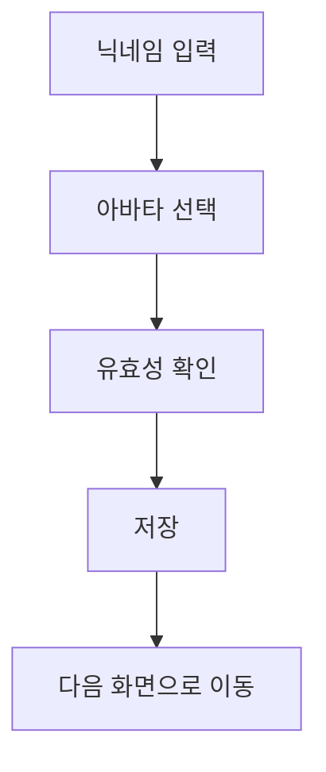

# 캐릭터 보드 설명서

이 문서는 캐릭터 보드가 단순 UI가 아니라, 게임 전반의 사용자 정체성을 만드는 핵심 단계라는 점을 설명합니다.
코드를 보여주기보다 화면에서 어떤 경험을 만들고, 왜 그런 선택을 했는지에 집중합니다.

---

## 캐릭터 보드가 하는 일

캐릭터 보드는 사용자가 게임에 들어오기 전에 자신의 이름과 아바타를 정하는 화면입니다.
여기서 정한 정보는 멀티플레이 입장, Ready 화면, 게임 중 정보 표시까지 계속 사용됩니다.

---

## 왜 중요한가

첫째, 상대가 나를 식별할 수 있게 해줍니다.
둘째, 사용자에게 “내 캐릭터”라는 감각을 주어 몰입도를 높입니다.
셋째, 이후 통신에서 표시할 기본 데이터가 안정적으로 정해집니다.

---

## 사용자가 느끼는 좋은 경험

입력이 복잡하지 않고, 선택 결과가 즉시 보이며, 다음 단계로 넘어가기 전에 부족한 항목이 무엇인지 바로 알 수 있어야 합니다.
즉, 캐릭터 보드는 화려함보다도 “실수 없이 자연스럽게 통과되는 경험”이 핵심입니다.

---

## 실수 방지 원칙

빈 닉네임, 너무 긴 이름, 빠른 연속 클릭 같은 실수는 서버까지 가지 않도록 화면에서 먼저 막는 것이 좋습니다.
이렇게 하면 불필요한 요청을 줄이고, 사용자도 즉시 수정할 수 있습니다.

---

## 다른 문서와의 연결

캐릭터 보드 다음 흐름은 [FEATURES.md](./FEATURES.md)와 [MULTIPLAYER_ENTRY_FLOW.md](./MULTIPLAYER_ENTRY_FLOW.md)에서 이어집니다.
