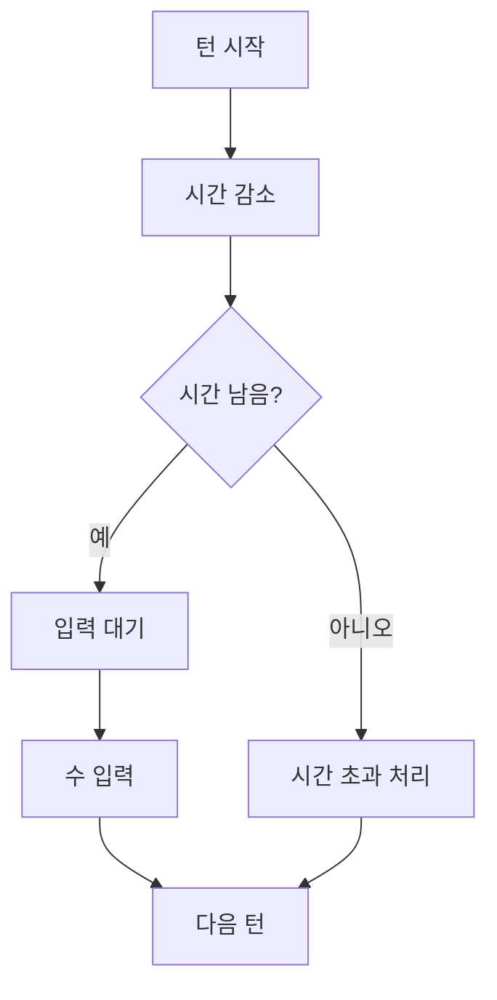

# 턴 제한 시간(카운트다운) 안내

이 문서는 카운트다운이 게임 템포를 어떻게 만들고, 사용자에게 어떤 신호를 주는지 설명합니다.
숫자 구현보다 경험 설계 관점으로 읽을 수 있도록 정리했습니다.

---

## 카운트다운의 목적

턴 제한 시간은 게임이 지연되지 않도록 흐름을 유지해 줍니다.
시간이 존재하면 플레이어는 결정을 미루기보다 빠르게 행동하게 되고, 경기 리듬이 일정해집니다.

---

## 기본 흐름

---

## 사용자에게 보여줘야 할 신호

사용자는 시간이 줄어들고 있다는 사실을 숫자 하나로만 느끼기 어렵습니다.
그래서 색상 변화, 경고 애니메이션, 소리 같은 보조 신호를 함께 사용하면 긴장도를 자연스럽게 전달할 수 있습니다.

---

## 시간 초과 시 원칙

시간 초과가 발생했을 때는 결과가 즉시 이해되어야 합니다.
누가 시간 초과했는지, 게임이 계속되는지 종료되는지, 다음 상태가 무엇인지 명확한 안내가 필요합니다.

---

## 안정성 관점

탭 전환, 일시 정지, 네트워크 지연 같은 현실적인 상황에서 타이머가 흔들리면 신뢰가 깨집니다.
핵심은 화면 숫자보다 “서버 기준 시간 상태”를 우선해 동기화하는 것입니다.
