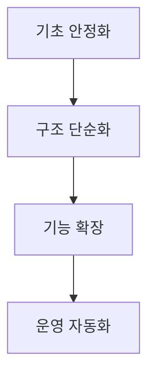

# 개발 전략 가이드

이 문서는 기능을 빠르게 추가하는 것보다, 유지보수 가능한 구조를 꾸준히 만드는 전략을 설명합니다.
보고서식 수치 나열 대신, 실제 팀이 판단할 때 필요한 기준을 문장으로 풀어씁니다.

---

## 전략의 출발점

현재 프로젝트가 어떤 문제를 가장 자주 겪는지 먼저 명확히 해야 합니다.
예를 들어 버그 재발이 많은지, 기능 추가가 느린지, 배포 후 장애 대응이 어려운지가 우선순위를 결정합니다.

---

## 권장 우선순위

1단계에서는 테스트와 타입 안정성을 확보합니다.
2단계에서는 상태 관리와 폴더 책임을 정리합니다.
3단계에서는 사용자 체감 기능을 확장합니다.
4단계에서는 모니터링과 배포 자동화로 운영 비용을 줄입니다.

---

## 의사결정 원칙

새로운 기술을 도입할 때는 "멋져 보이는가"보다 "문제를 실제로 줄이는가"를 먼저 봐야 합니다.
도입 전에는 기대효과를 문장으로 명확히 적고, 도입 후에는 같은 기준으로 검증해야 합니다.

---

## 팀 운영 관점

전략 문서는 한 번 작성하고 끝나는 문서가 아닙니다.
스프린트가 끝날 때마다 무엇이 맞았고 무엇이 빗나갔는지 기록을 갱신해야 다음 판단이 빨라집니다.

---

## 실무 적용 팁

큰 목표를 바로 실행하기보다, 실패해도 되돌리기 쉬운 작은 단위로 나눠 진행하는 것이 안전합니다.
작은 성공을 반복하면 전략 문서가 실제 실행 문서로 살아남습니다.
