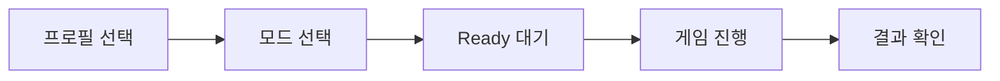
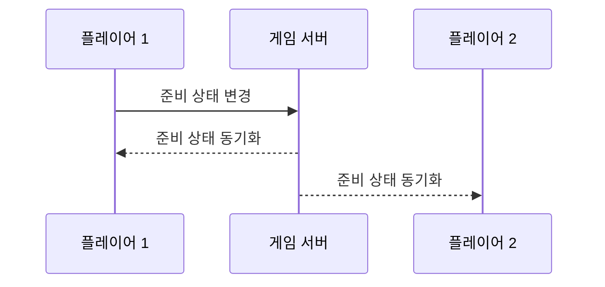

# 주요 기능 안내

이 문서는 프로젝트가 사용자에게 어떤 경험을 제공하는지, 그리고 각 기능이 실제로 어떤 상황에서 쓰이는지를 설명합니다.
코드를 먼저 보는 대신, 사용자가 화면에서 무엇을 하게 되는지부터 이해할 수 있도록 구성했습니다.

---

## 이 프로젝트가 제공하는 경험

사용자는 먼저 닉네임과 아바타를 정하고, 원하는 게임 모드를 선택한 뒤, Ready 화면에서 상대와 상태를 맞춘 다음 실제 게임에 들어갑니다.
게임 중에는 턴 제한 시간이 흘러가고, 채팅과 입장/퇴장 같은 실시간 이벤트가 즉시 반영됩니다.

---

## 1) 프로필 설정

프로필 설정은 단순히 이름을 입력하는 단계가 아니라, 이후 모든 멀티플레이 화면에서 사용자를 구분하는 기준을 만드는 단계입니다.
닉네임과 아바타는 상대 화면에도 표시되기 때문에, 첫 인상을 결정하는 정보이기도 합니다.

---

## 2) 게임 모드 선택

모드 선택은 플레이 방식 자체를 바꿉니다.
싱글 모드는 AI를 상대하는 개인 연습 중심의 흐름이고, 멀티 모드는 입장권 검증과 방 배정을 거친 실시간 대전 흐름입니다.
로컬 모드는 같은 기기에서 번갈아 플레이하는 파티형 흐름으로 이해하면 쉽습니다.

---

## 3) Ready 단계

Ready 단계의 핵심은 “상태 동기화”입니다.
나만 준비 버튼을 눌렀다고 게임이 시작되지 않고, 양쪽 상태가 모두 준비 완료가 되어야 시작됩니다.
준비 여부는 아바타의 시각 표현(예: 반투명/선명)으로 즉시 확인할 수 있어야 사용자가 혼동하지 않습니다.

---

## 4) 게임 진행

게임이 시작되면 턴, 보드 상태, 종료 조건은 서버 기준으로 맞춰집니다.
이 방식은 각 클라이언트가 임의로 승패를 판단하지 못하게 하므로 공정성과 일관성을 보장합니다.

---

## 5) 실시간 커뮤니케이션

채팅, 입장, 퇴장, 준비 상태 변경 같은 이벤트는 모두 “즉시 알림”으로 느껴져야 합니다.
사용자 입장에서는 내부 구조보다도 “상대가 들어왔는지, 준비했는지, 나갔는지”가 바로 보이는 것이 중요합니다.

---

## 6) 예외와 복구

연결 실패, 상대 이탈, 재접속 실패 같은 상황은 반드시 사용자 안내와 함께 처리되어야 합니다.
이 프로젝트는 실패를 숨기기보다, 사용자에게 현재 상태와 다음 행동(재시도/로비 이동)을 명확히 보여주는 방향을 목표로 합니다.

---

## 읽는 순서 제안

기능을 큰 그림에서 이해하고 싶다면 먼저 [MULTIPLAYER_OVERVIEW.md](./MULTIPLAYER_OVERVIEW.md)를 읽고,
진입 단계가 궁금하면 [MULTIPLAYER_ENTRY_FLOW.md](./MULTIPLAYER_ENTRY_FLOW.md),
입장 후 진행이 궁금하면 [MULTIPLAYER_INROOM_FLOW.md](./MULTIPLAYER_INROOM_FLOW.md)를 이어서 보면 됩니다.
