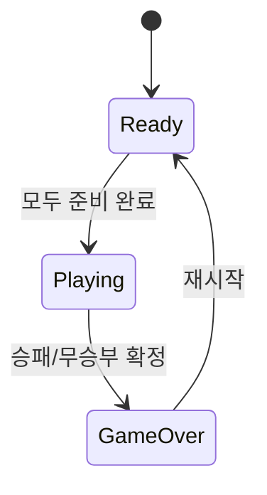

# 게임 매니저 개념 문서

게임 매니저는 화면에서 보이는 여러 동작을 순서대로 연결해 주는 조정자 역할을 합니다.
이 문서는 어떤 순서로 상태가 흘러가야 안정적인 게임이 되는지 설명합니다.

---

## 게임 매니저가 다루는 상태

게임 시작 전 대기, 진행 중 턴, 종료 후 결과 같은 장면은 각각 분리된 상태로 관리되어야 합니다.
상태 경계가 분명해야 화면 전환이 자연스럽고 버그를 추적하기도 쉬워집니다.

---

## 왜 조정자가 필요한가

보드, 타이머, 채팅, 알림이 각자 따로 움직이면 서로 충돌할 수 있습니다.
게임 매니저는 "지금 어떤 상태인가"를 기준으로 허용되는 동작만 통과시켜서 일관성을 지켜줍니다.

---

## 사용자 입장에서 중요한 것

사용자는 내부 상태 구조를 보지 않습니다.
다만 버튼을 눌렀을 때 기대한 화면으로 즉시 전환되고, 이전 장면의 흔적이 남지 않기를 기대합니다.
게임 매니저의 품질은 이런 전환의 자연스러움에서 드러납니다.

---

## 문서 연결

진입 흐름은 [MULTIPLAYER_ENTRY_FLOW.md](./MULTIPLAYER_ENTRY_FLOW.md),
방 내부 동기화는 [MULTIPLAYER_INROOM_FLOW.md](./MULTIPLAYER_INROOM_FLOW.md)에서 확인할 수 있습니다.
