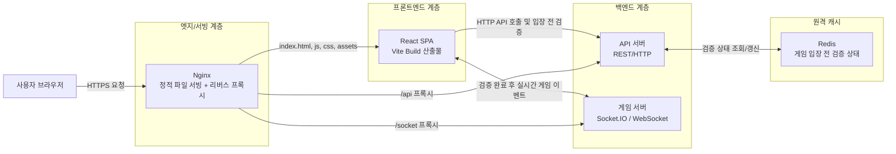
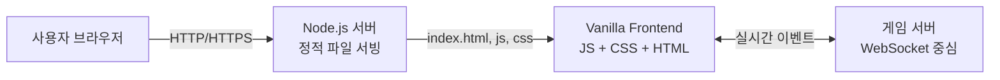
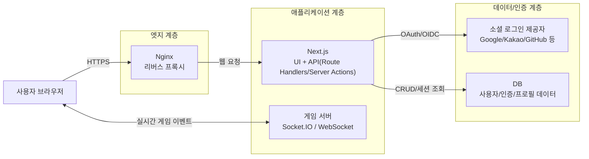

# 프로젝트 아키텍처 개요

이 문서는 클라이언트 프로젝트 전체 관점에서 시스템 구성과 기술 스택을 한 번에 파악하기 위한 문서입니다.
핵심은 **Nginx가 React 정적 리소스를 제공**하고, **React가 API 서버(HTTP)와 게임 서버(WebSocket)** 와 통신하는 구조입니다.

---

## 전체 시스템 아키텍처

---

## 아키텍처 변화 이력

초기 개발 단계에서는 CORS 이슈를 빠르게 우회하기 위해 **Node.js 서버에서 클라이언트 정적 파일을 함께 내려주는 방식**을 사용했습니다.
이 시기에는 API 기능은 거의 없었고, 핵심 실시간 기능은 **WebSocket 게임 서버** 중심으로 동작했습니다.
또한 프론트엔드는 프레임워크 없이 **Vanilla JS + CSS + HTML** 기반으로 구현했습니다.

### 1) 초기 구조 (MVP)

### 2) 현재 구조 (분리/확장)

- 정적 리소스 서빙/프록시는 Nginx로 분리
- 프론트엔드는 React SPA + TypeScript 기반으로 전환
- 백엔드는 API 서버와 게임 서버(실시간)를 역할별로 사용
- 게임 접근 전에는 Redis를 활용해 입장 가능 여부/검증 상태를 확인

이 전환으로 개발 생산성과 유지보수성, 화면/상태 관리 일관성, 실시간 기능 확장성이 좋아졌습니다.

---

## 향후 아키텍처 전환 계획

다음 단계 목표는 **기존 API 서버를 제거하고 API 기능을 Next.js로 이관**하는 것입니다.
또한 **소셜 로그인 기능 도입**과 함께 사용자/인증 정보를 관리하기 위한 **DB 연동**을 계획하고 있습니다.

### 목표 구조 (Planned)

### 전환 시 기대 효과

- API 서버 운영 포인트를 줄여 배포/운영 단순화
- 인증/세션/유저 데이터를 Next.js + DB 기준으로 일관되게 관리
- 소셜 로그인 도입으로 회원 진입 장벽 완화
- 프론트/백엔드 경계(API BFF) 정리로 기능 확장 속도 개선

### 전환 시 고려 사항

- 기존 클라이언트의 API 호출 경로를 Next.js API 경로로 일괄 전환
- 인증 토큰/세션 전략(쿠키 기반 세션 또는 JWT) 확정
- 게임 서버와 인증 연계(소켓 접속 시 사용자 검증) 설계

---

## 영역별 기술 스택

| 영역           | 역할                                        | 사용 기술                                                      |
| -------------- | ------------------------------------------- | -------------------------------------------------------------- |
| 서빙/인프라    | 정적 파일 제공, API/소켓 프록시             | Nginx, Docker                                                  |
| 클라이언트 앱  | 화면 렌더링, 라우팅, 상태 관리, 실시간 통신 | React 19, TypeScript, React Router, Zustand, Socket.IO Client  |
| 검증/캐시      | 게임 입장 전 검증 상태 확인                 | Redis                                                          |
| UI/스타일      | 디자인 시스템 및 애니메이션                 | Tailwind CSS 4, Framer Motion, GSAP, animate.css, lucide-react |
| 빌드/번들링    | 개발 서버 및 프로덕션 번들                  | Vite 7, @vitejs/plugin-react                                   |
| 테스트         | 단위/컴포넌트 테스트                        | Vitest, Testing Library, jsdom                                 |
| 모킹/개발 보조 | 개발 환경 API 모킹                          | MSW                                                            |

---

## 코드 구조와 책임

- `src/features/auth`: 닉네임/아바타 선택 등 인증(진입) UX
- `src/features/lobby`: 로비 관련 UI/상태/이벤트
- `src/features/game`: 게임 보드, 플레이어 상태, 채팅, 소켓 이벤트 처리
- `src/shared`: 공통 컴포넌트, 훅, 매니저, 유틸
- `src/stores`: 전역 상태 저장소(`zustand`)
- `src/mock`: MSW 핸들러 및 브라우저 워커 설정

---

## 관련 문서

- 멀티플레이 상세 흐름: [MULTIPLAYER_OVERVIEW.md](./MULTIPLAYER_OVERVIEW.md)
- 게임방 진입 플로우: [MULTIPLAYER_ENTRY_FLOW.md](./MULTIPLAYER_ENTRY_FLOW.md)
- 게임방 내부 플로우: [MULTIPLAYER_INROOM_FLOW.md](./MULTIPLAYER_INROOM_FLOW.md)
