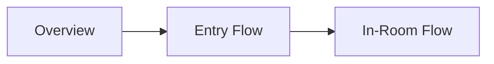

# 멀티플레이 문서 안내

이 문서는 긴 단일 문서를 읽기 어려웠던 문제를 해결하기 위해 만들어진 안내 페이지입니다.
아래 순서대로 읽으면 멀티플레이를 자연스럽게 이해할 수 있습니다.

---

## 권장 읽기 순서

1. 큰 그림 이해: [MULTIPLAYER_OVERVIEW.md](./MULTIPLAYER_OVERVIEW.md)
2. 게임방 진입까지: [MULTIPLAYER_ENTRY_FLOW.md](./MULTIPLAYER_ENTRY_FLOW.md)
3. 게임방 진입 이후: [MULTIPLAYER_INROOM_FLOW.md](./MULTIPLAYER_INROOM_FLOW.md)

---

## 이 문서들의 공통 원칙

- 코드 예시는 최소화하고 개념을 먼저 설명합니다.
- 필요한 시각 자료는 Mermaid 다이어그램으로 제공합니다.
- 보고서 형식보다 사용자가 읽기 쉬운 설명형 문체를 사용합니다.
