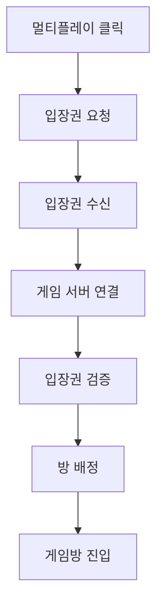

# 게임방에 들어가기까지의 흐름

이 문서는 멀티플레이 버튼을 누른 순간부터 게임방 화면에 들어가기까지를 단계별로 설명합니다.
복잡한 구현 세부보다 사용자가 실제로 어떤 과정을 지나가는지에 초점을 둡니다.

---

## 단계 요약

---

## 1단계: 멀티플레이 시작 의사 전달

사용자는 모드 선택 화면에서 멀티플레이를 선택합니다.
이 순간부터 시스템은 일반 화면 이동이 아니라 “실시간 세션 준비” 절차를 시작합니다.

## 2단계: 입장권 요청

클라이언트는 인증 서버에 게임 입장을 요청합니다.
이 과정은 누가 들어오는지 확인하고, 무분별한 접속을 막기 위한 관문입니다.

## 3단계: 입장권과 접속 정보 수신

인증 서버는 유효한 사용자라면 입장권과 게임 서버 정보를 함께 돌려줍니다.
클라이언트는 이 정보를 잠시 보관해 다음 연결 단계에서 사용합니다.

## 4단계: 게임 서버 연결 시도

클라이언트는 입장권을 포함해 게임 서버에 연결합니다.
여기서 핵심은 “연결 자체”보다 “검증된 연결”입니다.

## 5단계: 입장권 검증

게임 서버는 입장권 유효성, 만료 여부, 사용 가능 여부를 점검합니다.
검증이 통과되어야 다음 단계로 이동합니다.

## 6단계: 방 배정

대기 중인 방이 있으면 합류시키고, 없으면 새 방을 만듭니다.
이 단계가 끝나면 사용자는 어느 세션에 속했는지가 확정됩니다.

## 7단계: 게임방 진입 완료

클라이언트는 배정받은 방 정보를 바탕으로 Ready 화면으로 이동합니다.
여기까지가 “진입 흐름”이며, 이후는 방 내부 동기화 흐름으로 넘어갑니다.

---

## 실패했을 때 사용자 경험

검증 실패나 연결 실패가 발생하면, 사용자는 무엇이 잘못됐는지 알 수 있어야 합니다.
가장 중요한 원칙은 실패를 숨기지 않고, 재시도 또는 로비 복귀 같은 다음 행동을 명확히 안내하는 것입니다.
