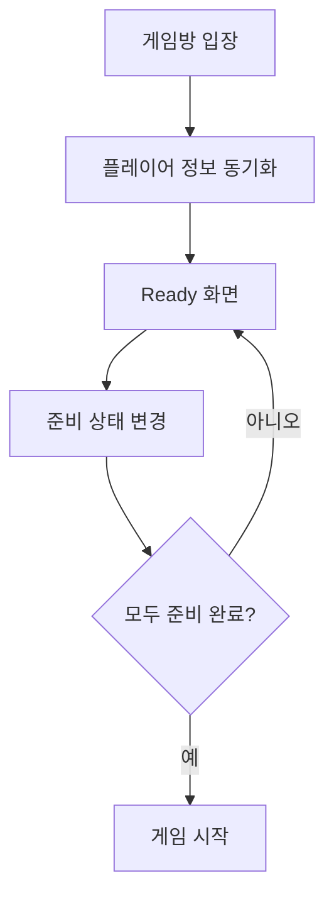
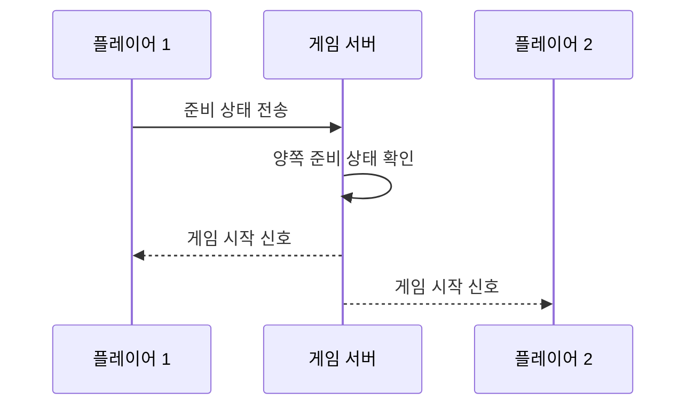

# 게임 시작 전 준비 단계

이 문서는 게임방에 들어온 후 게임이 실제로 시작되기 전까지의 과정을 설명합니다.
플레이어 정보 동기화, Ready 상태 관리, 게임 시작 조건을 사용자 관점에서 풀어냅니다.
게임 진행 중의 턴 로직과 종료 처리는 별도 문서에서 다룹니다.

---

## 전체 흐름

퀵 조인(Quick Join) 이라고도 하는데 쉽게 생각하면 아무 방이나 들어가기

---

## 1) 입장 직후: 정보 동기화

방에 들어오면 먼저 누가 있는지, 각자의 표시 정보가 무엇인지, 준비 상태가 어떤지를 맞춥니다.
이 과정이 안정적이어야 Ready 화면이 흔들리지 않고 자연스럽게 보입니다.

## 2) Ready 단계: 상태를 맞추는 시간

Ready 화면은 단순 대기가 아니라 상태 협의 구간입니다.
각 플레이어가 준비를 누를 때마다 서버에서 확정된 상태가 양쪽에 공유되고,
아바타 시각 표현으로 현재 준비 여부를 직관적으로 확인합니다.

## 3) 시작 조건 충족: 게임 전환

양쪽 모두 준비가 확인되면 서버가 시작 신호를 보냅니다.
클라이언트는 이 신호를 기준으로 실제 게임 화면으로 전환합니다.

