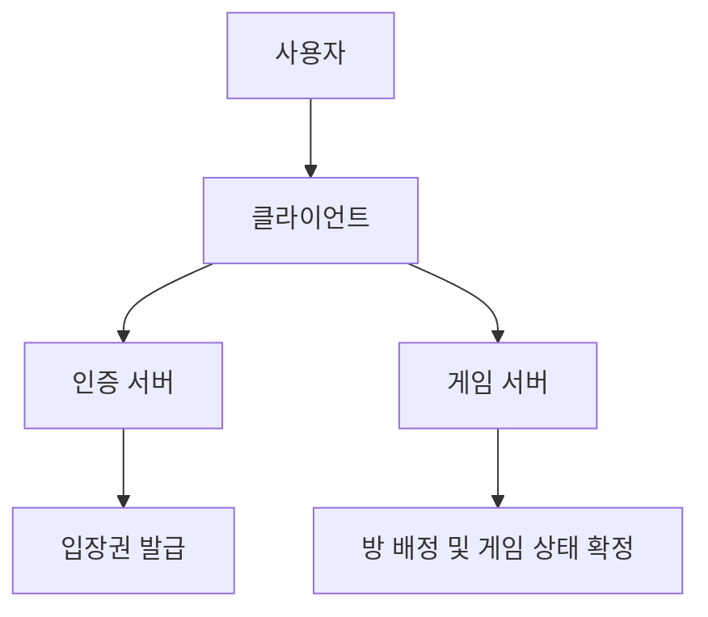

# 멀티플레이 얼개

이 문서는 멀티플레이를 처음 보는 사람이 전체 구조를 빠르게 이해하도록 돕는 안내서입니다.
세부 이벤트 이름보다 “누가 무엇을 책임지고, 상태가 어떻게 맞춰지는가”를 중심으로 설명합니다.

---

## 한 줄 요약

클라이언트는 화면과 입력을 담당하고, 인증 서버는 입장권을 발급하며, 게임 서버는 실시간 상태를 최종 확정합니다.

---

## 왜 서버가 중심인가

멀티플레이에서 가장 중요한 것은 “양쪽이 같은 화면을 본다”는 신뢰입니다.
이 신뢰를 유지하려면 누가 먼저 눌렀는지, 지금 누구 차례인지, 승패가 맞는지를 한 곳에서 확정해야 합니다.
그래서 게임 서버가 상태의 기준점이 됩니다.

---

## 사용자가 체감하는 흐름

사용자는 버튼을 누르고 바로 반응하길 기대합니다.
내가 준비를 누르면 내 화면만 바뀌는 것이 아니라 상대 화면도 같은 의미로 바뀌어야 하고,
내가 수를 두면 서버 검증 후 양쪽 보드가 동시에 갱신되어야 합니다.

---

## 문서 연결

이 문서는 배경 설명입니다.
실제 진입 절차는 [MULTIPLAYER_ENTRY_FLOW.md](./MULTIPLAYER_ENTRY_FLOW.md),
입장 후 진행은 [MULTIPLAYER_INROOM_FLOW.md](./MULTIPLAYER_INROOM_FLOW.md)에서 자세히 설명합니다.
