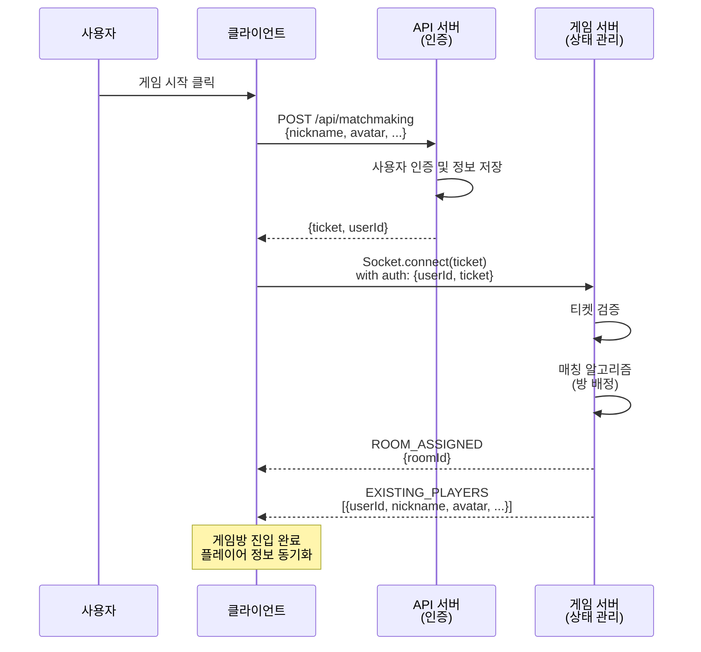
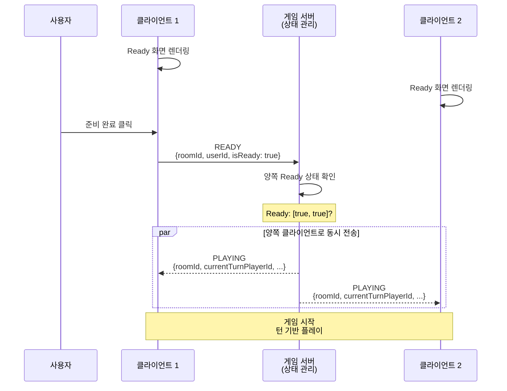

# 멀티플레이 얼개

이 문서는 멀티플레이를 처음 보는 사람이 전체 구조를 빠르게 이해하도록 돕는 안내서입니다.
세부 이벤트 이름보다 “누가 무엇을 책임지고, 상태가 어떻게 맞춰지는가”를 중심으로 설명합니다.

---

## 한 줄 요약

클라이언트는 화면과 입력을 담당하고, 인증 서버는 입장권을 발급하며, 게임 서버는 실시간 상태를 최종 확정합니다.

### 1단계: 게임방 진입 (매칭 및 플레이어 동기화)

### 2단계: 게임 시작 전 준비 (Ready 상태 협의)

---

멀티플레이에서 가장 중요한 것은 “양쪽이 같은 화면을 본다”는 신뢰입니다.
이 신뢰를 유지하려면 누가 먼저 눌렀는지, 지금 누구 차례인지, 승패가 맞는지를 한 곳에서 확정해야 합니다.
그래서 게임 서버가 상태의 기준점이 됩니다.

---

## 왜 퀵조인 방식인가

### 설계 배경

기존 "로비 → 방 목록 → 방 선택 → 게임 진입" 방식 대신 **퀵조인(Quick Join)** 방식을 선택했습니다.

**주요 이유:**

- **매칭 알고리즘의 자연스러운 확장**: 진입 과정 자체가 매칭 요청이므로, 향후 레이팅 기반 매칭이나 실력별 매칭 로직을 진입 단계에 자연스럽게 추가할 수 있습니다.
- **사용자 경험 간소화**: 방 목록을 탐색하고 선택하는 중간 단계 없이, "게임 시작" 버튼 하나로 빠르게 매칭됩니다.
- **서버 부하 분산**: 방 목록 관리와 실시간 업데이트 부담 없이, 매칭 로직만 집중 관리할 수 있습니다.

### 미래 확장 고려

현재는 단순 "아무 방이나 배정" 방식이지만, 다음과 같은 확장을 염두에 두고 설계했습니다:

- **매칭 서버 분리**: 게임 서버와 별도로 매칭 전용 서버 구축 가능
- **사용자 데이터 기반 매칭**: 레이팅, 승률, 플레이 스타일 등의 데이터가 충분히 쌓이면 정교한 매칭 알고리즘 적용

> **참고**: 매칭 서버를 당장 분리하지 않은 이유는 필요한 사용자 데이터(레이팅, 플레이 히스토리 등)가 아직 충분히 파악되지 않았기 때문입니다. 현재는 기본 매칭 로직으로 시작하고, 데이터가 쌓이면 단계적으로 고도화할 예정입니다.

---

## 사용자가 체감하는 흐름

사용자는 버튼을 누르고 바로 반응하길 기대합니다.
내가 준비를 누르면 내 화면만 바뀌는 것이 아니라 상대 화면도 같은 의미로 바뀌어야 하고,
내가 수를 두면 서버 검증 후 양쪽 보드가 동시에 갱신되어야 합니다.

---

## 문서 연결

이 문서는 배경 설명입니다.
실제 진입 절차는 [MULTIPLAYER_ENTRY_FLOW.md](./MULTIPLAYER_ENTRY_FLOW.md),
입장 후 진행은 [MULTIPLAYER_INROOM_FLOW.md](./MULTIPLAYER_INROOM_FLOW.md)에서 자세히 설명합니다.
