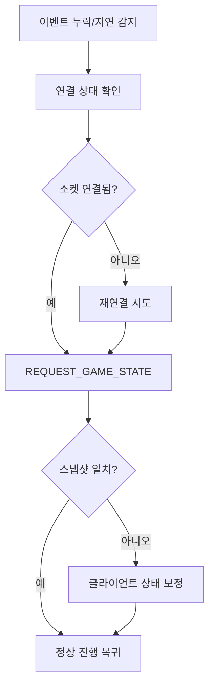

# 멀티플레이 갇힘(Stuck) 케이스 대응 가이드

이 문서는 멀티플레이에서 사용자가 대기 상태에 갇히는 상황을 정리하고,
기획/클라이언트/서버가 같은 기준으로 대응하기 위한 운영 문서입니다.

---

## 문서 목적

핵심 목표는 "어떤 단계에서도 유저가 영원히 기다리지 않게" 만드는 것입니다.
상태 불일치가 발생하더라도 복구 경로를 제공하고,
사용자에게 현재 대기 이유와 다음 행동을 항상 보여주는 것을 원칙으로 합니다.

---

## 주요 갇힘 케이스

1. 준비 단계에서 한 명만 Ready
2. 한쪽은 PLAYING, 다른 쪽은 READY로 상태 분기
3. 내 턴인데 입력이 오지 않아 게임이 멈춤
4. 상대 턴인데 상대 클라이언트가 MOVE를 보내지 못함
5. MOVE 발송 후 MOVE_MADE 미수신으로 대기 고착
6. MOVE_MADE 수신 후 NEXT_TURN 누락
7. GAME_OVER 누락으로 종료 화면 미노출
8. PLAYER_LEFT 누락으로 없는 상대를 계속 기다림
9. 새로고침/재접속 후 상태 복원 실패
10. 중복 이벤트 수신으로 보드/턴 오염
11. 다중 클릭으로 중복 MOVE 전송
12. 서버 시간과 클라 타이머 불일치

---

## 대응 원칙

### 1) 서버 단일 진실 소스

턴 진행, 타임아웃, 종료 판정은 서버 이벤트를 기준으로 처리합니다.
클라이언트는 입력 게이트와 표시 역할에 집중합니다.

### 2) 상태 머신 기반 전이

다음과 같은 상태를 정의하고, 허용 이벤트만 전이하도록 제한합니다.

- `ready_waiting`
- `ready_confirmed`
- `playing_turn_me`
- `playing_turn_opponent`
- `waiting_move_ack`
- `game_over`
- `recovering`

### 3) 단계별 타임아웃

각 단계는 최대 대기 시간을 가져야 하며,
시간 초과 시 재시도/복구/이탈 옵션을 노출합니다.

---

## 권장 정책

### 준비 단계

상대가 일정 시간 Ready 하지 않으면 선택지를 제공합니다.

- 계속 대기
- 방 나가기
- (선택) AI 대체 모드 전환

### 플레이 단계

턴 타임아웃은 서버가 판정합니다.
클라이언트는 남은 시간을 안내하고, 서버 결과를 그대로 반영합니다.

### MOVE ACK 단계

`waiting_move_ack`에 최대 대기 시간을 둡니다.
시간 초과 시 상태 재동기화(`REQUEST_GAME_STATE`)를 우선 수행하고,
필요하면 제한된 재전송 정책을 적용합니다.

### 종료 단계

`GAME_OVER` 누락이 의심되면 스냅샷 재조회로 종료 상태를 보정합니다.

---

## 복구 플로우

---

## UX 가이드

무한 스피너를 금지합니다.
대기 UI에는 항상 "현재 이유"와 "다음 행동"을 명시합니다.

- 현재 이유 예시: 상대 입력 대기, 서버 응답 대기, 재연결 중
- 다음 행동 예시: 재시도, 상태 동기화, 로비 나가기

---

## 관측성(Observability)

운영 중 갇힘 이슈를 빠르게 찾기 위해 아래 지표를 수집합니다.

- 상태별 평균 체류 시간
- MOVE ACK 타임아웃 비율
- 재연결 성공률
- 상태 재동기화 성공률
- 이벤트 중복/역순 수신 비율

진단 로그에는 최소한 아래 키를 포함합니다.

- `roomId`
- `turnNumber`
- `currentState`
- `lastEventAt`
- `socketConnected`

---

## QA 체크리스트

1. 한쪽만 Ready 상태에서 장시간 대기해도 탈출 경로가 보이는가
2. 내 턴 미입력/상대 미입력에서 서버 타임아웃이 정상 반영되는가
3. MOVE 발송 후 ACK 누락 시 자동 복구가 동작하는가
4. 이벤트 순서가 뒤섞여도 최종 보드/턴 상태가 일관적인가
5. 재접속 후 READY/PLAYING/GAME_OVER 상태가 서버와 일치하는가
6. 상대 이탈 시 사용자 안내와 로비 복귀가 자연스러운가

---

## 운영 메모

이 문서는 일회성 문서가 아니라 릴리즈마다 갱신되는 문서입니다.
실제 장애/문의 사례를 케이스 목록에 추가하고,
대응 정책의 효과를 지표로 검증해 업데이트합니다.
