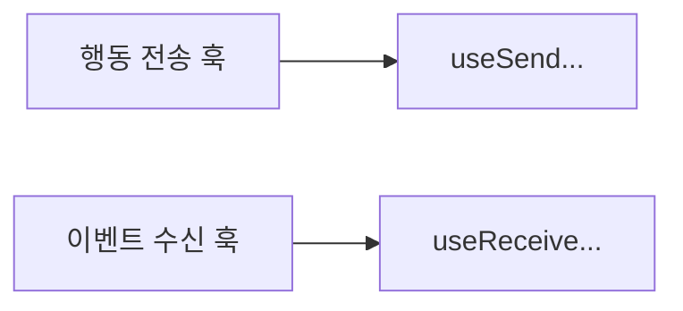

# 네이밍 규칙 안내

이 문서는 이름을 예쁘게 짓는 규칙이 아니라, 협업 중 오해를 줄이기 위한 약속을 설명합니다.
코드 예시는 최소화하고, 이름이 전달해야 하는 의미를 중심으로 정리합니다.

---

## 네이밍의 목적

좋은 이름은 주석을 줄이고, 코드를 처음 보는 사람도 흐름을 예상하게 만듭니다.
반대로 모호한 이름은 작은 수정에도 큰 탐색 비용을 만들고, 버그 대응 속도를 늦춥니다.

---

## 기본 원칙

첫째, 역할이 이름에 드러나야 합니다.
둘째, 같은 개념은 어디서나 같은 단어를 써야 합니다.
셋째, 전송(send)과 수신(receive)처럼 방향이 중요한 개념은 접두어로 명확히 구분합니다.

---

## 훅 이름 기준

이 구분이 유지되면 파일을 열기 전에도 역할을 예측할 수 있습니다.

---

## 문서 이름 기준

문서 이름은 기능명만 적기보다 읽는 목적이 드러나야 합니다.
예를 들어 overview, entry-flow, inroom-flow처럼 단계와 관점을 이름에 담으면 탐색 시간이 줄어듭니다.

---

## 팀 합의 방식

네이밍 규칙은 완벽한 정답보다 팀 내 일관성이 중요합니다.
새 규칙이 필요하면 문서에 즉시 반영하고, 기존 이름도 점진적으로 맞춰가는 방식을 권장합니다.
