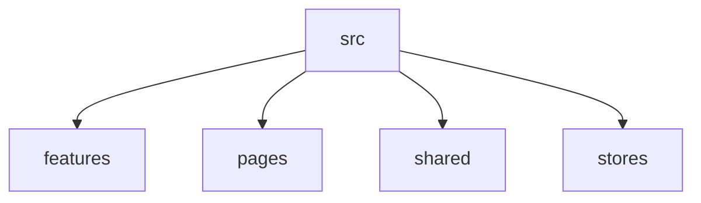

# 프로젝트 구조 안내

이 문서는 폴더 트리를 나열하는 데서 끝나지 않고, 각 영역이 왜 존재하는지와 무엇을 책임져야 하는지를 설명합니다.
처음 합류한 사람이 구조를 빠르게 이해할 수 있도록 서술형으로 정리합니다.

---

## 구조를 보는 관점

프로젝트 구조는 파일 위치의 문제가 아니라 책임 분리의 문제입니다.
같은 기능을 구현하더라도, 어디에 두느냐에 따라 유지보수 난이도가 달라집니다.

---

## 큰 영역

- features: 기능 단위의 화면/훅/로직
- pages: 라우트 단위 진입 화면
- shared: 여러 기능에서 공통으로 쓰는 모듈
- stores: 전역 상태 저장소

---

## 왜 이렇게 나누는가

기능 단위 폴더는 변경 범위를 국소화합니다.
공통 영역(shared)은 중복을 줄이지만, 무분별하게 커지지 않도록 기준이 필요합니다.
페이지는 라우팅 중심으로 얇게 유지하고, 실제 로직은 훅이나 매니저로 분리하는 것이 좋습니다.

---

## 구조가 건강한지 확인하는 질문

한 파일을 바꾸기 위해 너무 많은 폴더를 오가야 하는가?
공통 모듈이 특정 기능에 과도하게 의존하는가?
페이지가 로직으로 비대해지고 있지는 않은가?

이 질문에 자주 “예”가 나오면 구조 개선 시점입니다.
