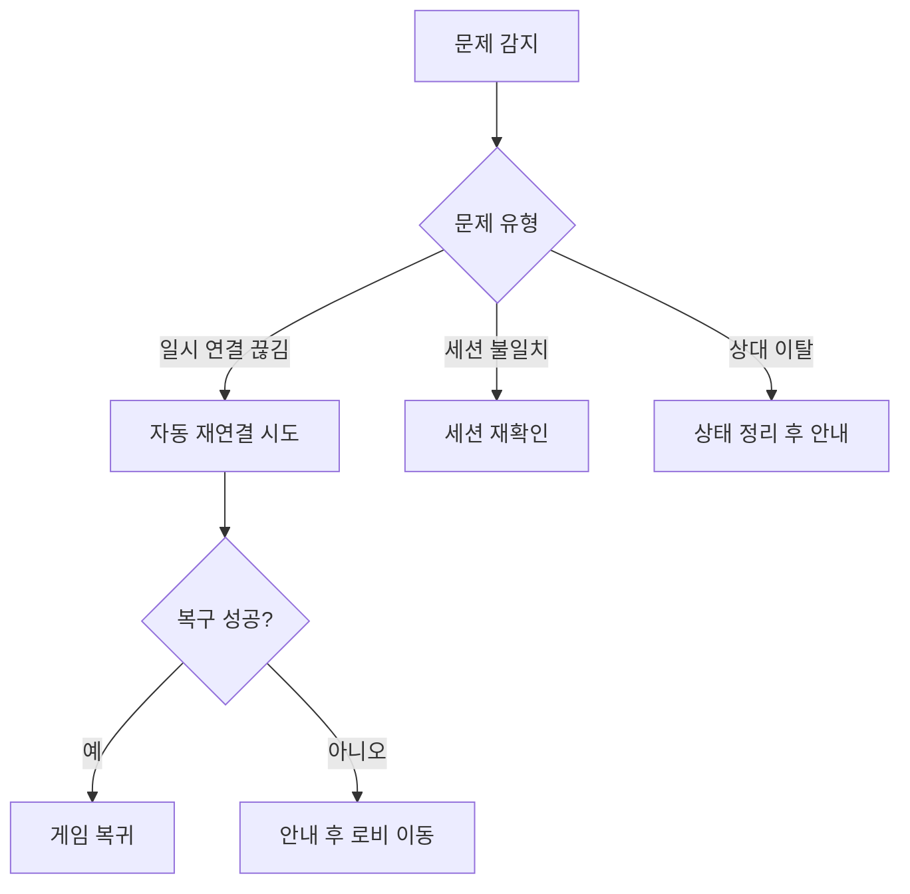

# 복구 메커니즘 안내

이 문서는 연결 끊김, 새로고침, 상대 이탈 같은 비정상 상황에서 사용자가 어떻게 자연스럽게 복귀하는지 설명합니다.
이 매커니즘에서 핵심은 실패 자체보다, 실패 이후의 빠르게 정상 궤도로 달리도록 만드는 것입니다.

---

## 복구가 필요한 이유

실시간 게임에서는 네트워크 문제를 완전히 없앨 수 없습니다.
그래서 중요한 것은 장애를 막는 것만이 아니라, 장애가 생겼을 때 상태를 안전하게 회복하는 절차입니다.

---

## 복구 흐름

---

## 사용자 안내 원칙

복구 중에는 “지금 무엇을 시도 중인지”를 알려줘야 불안이 줄어듭니다.
복구 실패 시에는 원인 추정보다 다음 행동을 먼저 제시해야 합니다.
예를 들어 재시도 버튼이나 로비 이동 버튼을 명확히 제공하는 방식이 효과적입니다.

---

## 상태 정리 원칙

복구 실패로 세션을 종료할 때는 화면 상태, 저장소 상태, 연결 상태를 함께 정리해야 합니다.
일부만 정리되면 다음 진입에서 오래된 데이터가 남아 이상 동작을 만들 수 있습니다.

---

## 상태 저장 기준 (명시)

복구 관련 상태는 아래 기준으로만 나눕니다.

### 1) Zustand(persist)로 관리할 것

- 게임의 **도메인 상태** (여러 컴포넌트가 함께 읽고/갱신하는 핵심 상태)
- 예: 착수 내역, 현재 턴 기준 시각, 타임아웃 주체, 게임 진행 단계
- 요구 특성: 상태 일관성, 전역 반응성, 재진입 시 동일한 게임 문맥 복원

### 2) sessionStorage 스냅샷으로 관리할 것

- **이벤트 기반 임시 복구값** (서버 이벤트 수신 시점 기준으로 잠깐 복원에만 쓰는 값)
- 예: READY/TURN 카운트다운 시작 시각 + 제한시간 스냅샷
- 요구 특성: 탭 단위 임시 유지, 세션 종료 시 즉시 폐기, 단독 UI 복원 목적

### 3) 선택 기준 체크리스트

- 이 값이 게임 규칙/승패/턴 판정에 직접 관여하면 → **Zustand**
- 이 값이 "새로고침 후 남은 시간 표시" 같은 보조 복원값이면 → **sessionStorage 스냅샷**
- 여러 화면/훅에서 동시에 참조하고 반응형 업데이트가 필요하면 → **Zustand**
- 서버 이벤트를 다시 받으면 즉시 대체 가능한 일회성 값이면 → **sessionStorage 스냅샷**

### 4) 팀 적용 원칙

- 동일 성격의 상태는 저장 수단을 혼합하지 않습니다.
- 신규 복구 상태를 추가할 때는 먼저 위 체크리스트로 저장 위치를 결정합니다.
- 문서와 구현이 다르면 구현을 수정하거나 문서를 즉시 업데이트합니다.

---

## 운영 관점

복구 로직은 잘 동작할 때 보이지 않기 때문에, 로그와 모니터링이 필수입니다.
실패 빈도와 복귀 성공률을 꾸준히 확인해야 개선 우선순위를 잡을 수 있습니다.
