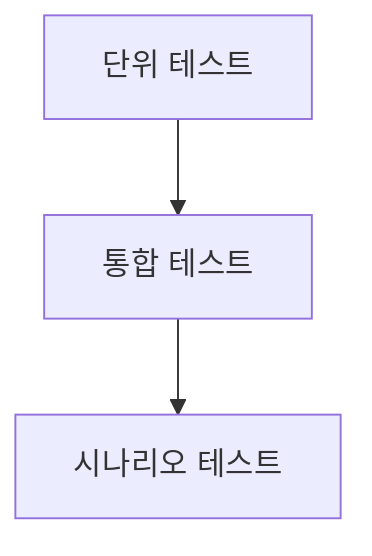

# 테스트 가이드

이 문서는 테스트 도구 사용법보다, 무엇을 왜 검증해야 하는지에 집중한 실전 안내서입니다.
코드 조각 대신 테스트 사고방식과 시나리오를 문장으로 설명합니다.

---

## 테스트 목표

테스트의 목적은 버그를 0으로 만드는 것이 아니라, 위험한 변경을 빠르게 감지하는 것입니다.
특히 멀티플레이 프로젝트에서는 동기화, 상태 전환, 예외 복구가 핵심 검증 대상입니다.

---

## 추천 테스트 레이어

단위 테스트는 순수 로직 안정성을,
통합 테스트는 컴포넌트/훅 상호작용을,
시나리오 테스트는 실제 사용자 흐름 완성도를 확인합니다.

---

## 우선 검증해야 할 시나리오

1. 게임방 진입이 정상적으로 끝나는가
2. 준비 상태가 양쪽 화면에서 동일하게 보이는가
3. 게임 중 입력이 서버 기준으로 동기화되는가
4. 상대 이탈이나 연결 끊김 시 안내와 복귀가 자연스러운가

---

## 실패를 다루는 방식

테스트 실패는 단순한 에러가 아니라 설계 신호입니다.
어느 계층에서 실패했는지 먼저 분류하고, 재현 조건을 문서화해 팀이 같은 문제를 반복하지 않게 해야 합니다.

---

## 문서 운영 방식

테스트 가이드는 릴리즈 직전에만 보는 문서가 아닙니다.
기능 추가 시점마다 “새로운 실패 가능성”을 한 줄이라도 업데이트해야 실제 품질 문서로 기능합니다.
