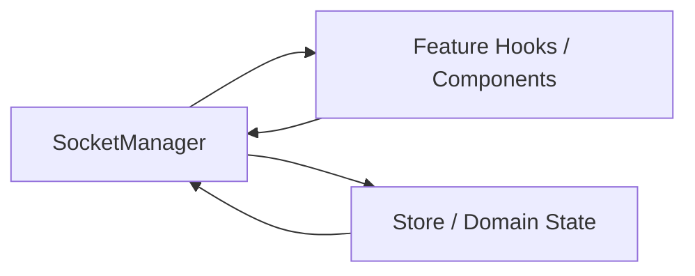
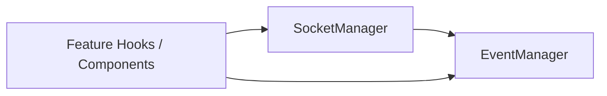

# WebSocket 순환참조 이슈 정리

이 문서는 WebSocket 연동 과정에서 발생할 수 있는 모듈 순환참조(circular dependency) 문제를 정의하고,
현재 프로젝트에서 적용한 해결 방식과 검증 결과를 기록합니다.

---

## 1) 문제정의

멀티플레이 기능 확장 과정에서 WebSocket 이벤트 처리 로직이 여러 훅/컴포넌트/스토어로 퍼지면서,
다음과 같은 의존성 고리가 생길 위험이 있었습니다.

- `SocketManager`가 기능 훅 또는 상태 모듈을 직접 참조
- 기능 훅/상태 모듈이 다시 `SocketManager`를 참조
- 결과적으로 `A -> B -> A` 형태의 순환 import 발생 가능

순환참조가 생기면 초기화 순서 문제, 런타임에서 `undefined` 참조, 예측 어려운 사이드이펙트가 나타날 수 있습니다.

---

## 2) 원인분석

WebSocket 코드에서 순환참조가 자주 생기는 구조적 이유는 다음과 같습니다.

- 연결 계층(`SocketManager`)과 도메인 계층(게임 훅/스토어)이 서로의 구현을 직접 호출하려고 함
- 수신 이벤트를 처리하기 위해 `SocketManager`가 UI/상태 코드를 직접 import하려는 유혹이 큼
- 반대로 송신/연결 관리를 위해 훅/컴포넌트가 `SocketManager`를 import함

즉, 수신/송신 책임이 분리되지 않으면 양방향 의존이 쉽게 만들어집니다.

위 구조에서는 `SocketManager <-> Feature` 또는 `SocketManager <-> Store` 형태의 고리가 생길 여지가 큽니다.

---

## 3) 액션

현재 프로젝트에서는 `EventManager`를 이벤트 버스로 두어 의존 방향을 분리했습니다.

- `SocketManager`는 서버 이벤트 수신 후 `eventManager.emit(...)`만 수행
- 기능 훅/컴포넌트는 `eventManager.on(...)`으로 구독
- 송신이 필요한 경우에만 훅에서 `gameSocketManager.sendMessage(...)` 사용

핵심 의존 방향:

- `SocketManager -> EventManager`
- `feature hooks/components -> EventManager`
- (필요 시) `feature hooks -> SocketManager`

이 구조에서 `EventManager`는 다른 매니저/훅을 import하지 않으므로, 중심 고리 형성을 방지합니다.

---

## 3-1) EventManager 도입 후 도식화

이벤트 버스 계층을 두면 수신 경로가 `SocketManager -> EventManager`로 고정되고,
기능 계층은 `EventManager`를 구독하는 방식으로 분리됩니다.

이 구조의 핵심은 `SocketManager`가 기능 계층을 직접 import하지 않아,
양방향 의존 고리 형성 가능성을 크게 낮춘다는 점입니다.

---

## 4) 결과

정적 분석 기준으로 현재 `src` 내 순환참조는 발견되지 않았습니다.

실행 명령:

- `npx madge --circular --extensions ts,tsx src`

결과:

- `No circular dependency found!`

정리하면, `EventManager` 도입은 현재 코드베이스에서 WebSocket 관련 의존성 결합을 낮추고,
순환참조 리스크를 실질적으로 줄이는 데 효과가 확인되었습니다.

---

## 5) Madge가 정확히 무엇인가

`madge`는 JavaScript/TypeScript 프로젝트의 import 관계를 그래프로 분석하는 정적 분석 도구입니다.

- 어떤 파일이 어떤 파일을 참조하는지 의존성 트리를 분석
- 순환참조(`A -> B -> A`)를 탐지
- 옵션에 따라 그래프 시각화(이미지/JSON) 출력 가능

이번 검증에서는 아래 명령으로 `src` 전체의 순환참조를 검사했습니다.

- `npx madge --circular --extensions ts,tsx src`

각 옵션 의미:

- `npx`: 로컬 설치 없이 패키지를 실행
- `--circular`: 순환참조만 출력
- `--extensions ts,tsx`: 분석할 파일 확장자 지정
- `src`: 분석 시작 루트 디렉터리

즉, 이 명령의 목적은 "현재 코드베이스에 실제 순환 import가 존재하는지"를 자동으로 검증하는 것입니다.

---

## 참고

`EventManager`가 없다고 해서 순환참조가 반드시 발생하는 것은 아닙니다.
다만 현재와 같이 다수의 훅/컴포넌트가 WebSocket과 상호작용하는 구조에서는,
중립적인 이벤트 버스 계층이 있을 때 순환참조 예방과 유지보수 측면에서 더 안전합니다.
